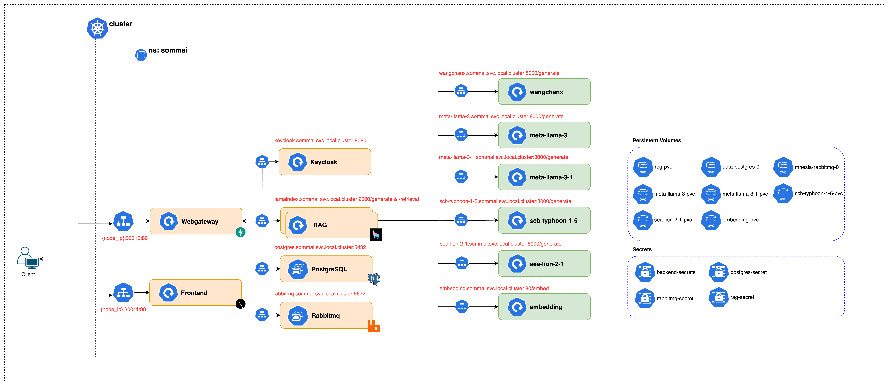

# Sommai Infrastructure

## Overview

This project is organized into various applications and services that are deployed using Kubernetes manifests. The directory structure is designed to support a modular approach, using Kustomize for easier management of deployments and configurations.

## Table of Contents
- [Sommai Infrastructure](#sommai-infrastructure)
  - [Overview](#overview)
  - [Table of Contents](#table-of-contents)
  - [Kubernetes Structure](#kubernetes-structure)
    - [Applications](#applications)
      - [Embedding](#embedding)
      - [Frontend](#frontend)
      - [LLM (Large Language Models)](#llm-large-language-models)
      - [RAG (Retrieval Augmented Generation)](#rag-retrieval-augmented-generation)
      - [Web Gateway](#web-gateway)
    - [Third-Party Integrations](#third-party-integrations)
      - [Keycloak](#keycloak)
      - [Postgres](#postgres)
      - [RabbitMQ](#rabbitmq)
  - [Setup](#setup)
  - [Usage](#usage)

## Kubernetes Structure

The kustomization structure is organized as follows:



```
.
├── applications
│   ├── embedding
│   ├── frontend
│   ├── llm
│   │   ├──meta-llama-3
│   │   ├──meta-llama-3-1
│   │   ├──scb-typhoon-1-5
│   │   ├──sea-lion-2-1
│   ├── rag
│   └── webgateway
├── kustomization
│   ├── kustomization.yaml
│   ├── namespace.yaml
│   ├── keycloak.env
│   ├── postgres.env
│   ├── rag.env
├── third
│   ├── keycloak
│   ├── postgress
│   ├── rabbitmq
```

### Applications

Each application in this project contains its own deployment, service, and kustomization YAML files to manage the Kubernetes resources.

#### Embedding
Contains resources for the embedding service, responsible for handling vector embeddings in the system.
- `deployment.yaml`: Deploys the embedding service.
- `service.yaml`: Exposes the embedding service internally/externally.

#### Frontend
Holds the resources for the frontend web interface of the project.
- `deployment.yaml`: Manages the frontend deployment.
- `service.yaml`: Exposes the frontend service.

#### LLM (Large Language Models)
Contains subdirectories for different LLM models used in the project.
- `meta-llama-3`, `meta-llama-3-1`, `scb-typhoon-1-5`, `sea-lion-2-1`: Each subdirectory contains deployment, service, and kustomization files to manage specific LLM deployments.

#### RAG (Retrieval Augmented Generation)
Manages the RAG service, which is responsible for integrating retrieval capabilities with generative models.
- `deployment.yaml`: Manages the RAG deployment.
- `service.yaml`: Exposes the RAG service.

#### Web Gateway
Contains deployment and service files for the web gateway, which acts as the central access point for the project’s services.
- `deployment.yaml`: Manages the gateway deployment.
- `service.yaml`: Exposes the web gateway service.

### Third-Party Integrations

This directory contains configurations for third-party tools required by the system.

#### Keycloak
Manages authentication and authorization for the system.
- `deployment.yaml`: Deploys Keycloak.
- `service.yaml`: Exposes Keycloak service.

#### Postgres
Holds the database configuration for the project.
- `statefulset.yaml`: Deploys Postgres as a StatefulSet.
- `service.yaml`: Exposes the Postgres database service.

#### RabbitMQ
Message broker service for handling messaging between services.
- `statefulset.yaml`: Deploys RabbitMQ as a StatefulSet.
- `service.yaml`: Exposes the RabbitMQ service.

## Setup

1. Ensure you have the following tools installed:
   - [kubectl](https://kubernetes.io/docs/tasks/tools/)
   - [Kustomize](https://kustomize.io/)
2. Clone the repository:
   ```bash
   git clone https://github.com/vistec-AI/Sommai-Legal-Assistant.git
   cd sommai-legal-assistant/kustomize
   ```
3. Apply Kustomize configurations:
   ```bash
   kustomize build kustomization/ | kubectl apply -f -
   ```

## Usage

- Deploy applications using Kustomize:
  ```bash
  kustomize build applications/embedding | kubectl apply -f -
  ```
- Access the frontend application via the web gateway.
- For authentication, use Keycloak to manage users and roles.